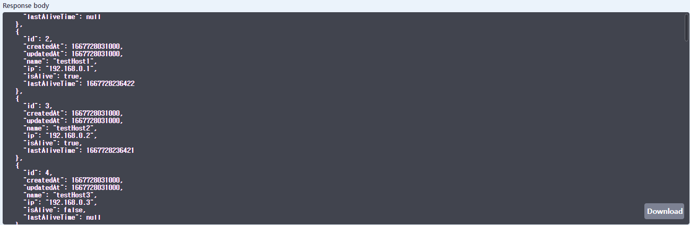
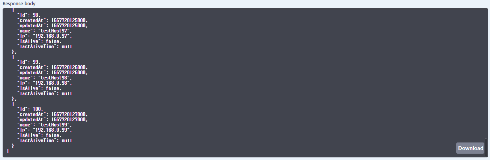
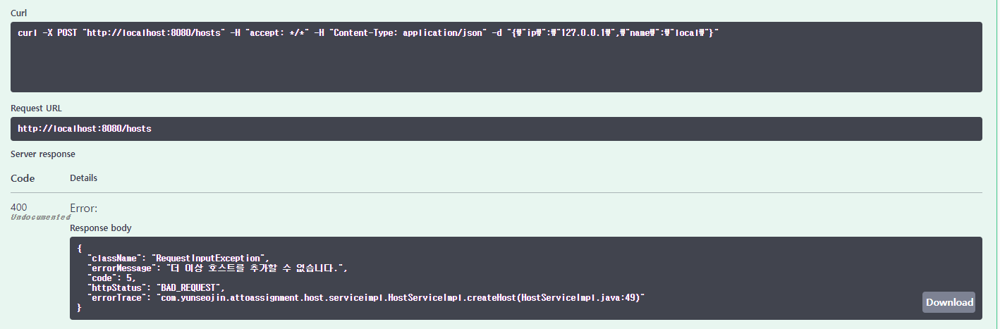
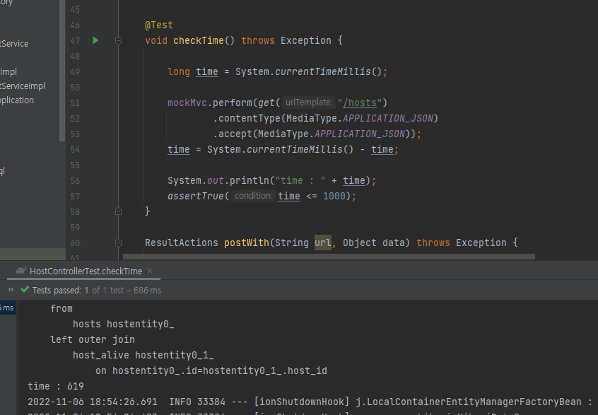
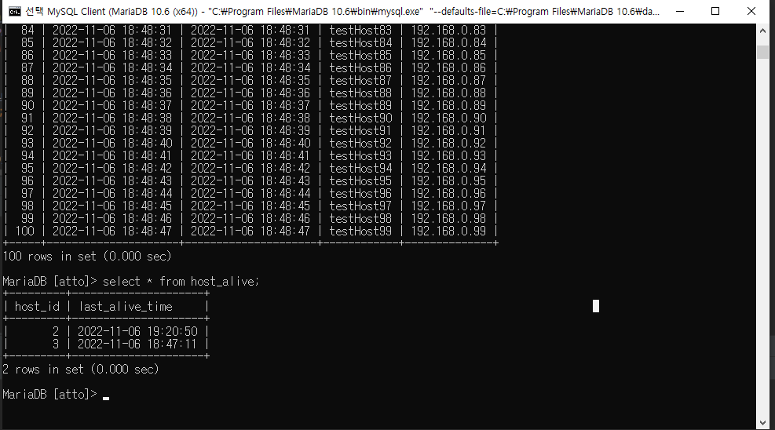

## 제약 사항
- JDK 11
- MariaDB 10.6
- Gradle
- Spring-Boot 2.6.14
- 단일 서버 기준(호스트 갯수 문제)

## api
### 1. createHost(post /hosts)
- 호스트를 등록하는 api
- name과 ip를 데이터로 사용
- name과 ip는 각각 다른 호스트와 중복될 수 없음
- 호스트의 전체 갯수는 100을 초과할 수 없음
- 추가 후 호스트의 정보를 반환
### 2. updateHost(put /hosts/{host_id})
- 호스트를 수정하는 api
- 수정할 호스트의 id,수정할 name, ip를 데이터로 사용
- name과 ip는 각각 다른 호스트와 중복될 수 없음
- 수정할 호스트가 없으면 예외 발생
- 수정 후 호스트의 정보를 반환
### 3. deleteHost(delete /hosts/{host_id})
- 호스트를 삭제하는 api
- 삭제할 호스트의 id를 데이터로 사용
### 4. isAliveHost(get /hosts/{host_id}/is_alive)
- 특정 호스트의 현재 alive 상태를 조회하는 api
- 호스트가 alive 상태일 경우 마지막 alive 시간을 저장
### 5. getHost(get /hosts/{host_id})
- 특정 호스트의 상태를 모니터링하는 api
- 호스트가 alive 상태일 경우 마지막 alive 시간을 저장
- 호스트의 정보와 alive 상태, 마지막 alive 시간을 반환
### 6. getAllHosts(get /hosts)
- 전체 호스트의 상태를 모니터링하는 api
- 호스트가 alive 상태일 경우 마지막 alive 시간을 저장
- 호스트 갯수 만큼 스레드를 사용해 동시에 상태를 확인
- 호스트의 정보와 alive 상태, 마지막 alive 시간을 반환
## 시험 결과
### 1. alive 상태인 호스트 조회 시

### 2. dead 상태인 호스트 조회 시

### 3. 호스트가 100개 일 때 등록 시

### 4. 호스트가 100개인 상태로 getAllHosts 호출 시 시간

### 5. DB에 저장된 데이터
